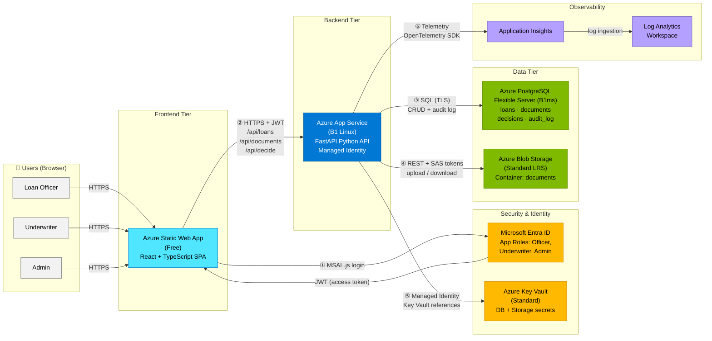

# Lending Management System (LMS) -- Architecture Overview

> Azure-hosted loan origination workflow with role-based access, document management, and audit trail.

## Key Architecture Decisions

| Decision | Choice | Rationale |
|---|---|---|
| **Frontend hosting** | Static Web App (Free) | Zero-cost SPA hosting with built-in CI/CD and custom domain support |
| **Backend hosting** | App Service B1 Linux | Right-sized for POC load; easy scaling path to P1v3 for production |
| **Database** | PostgreSQL Flexible Server B1ms | Managed Postgres with Entra auth support; 2 vCores sufficient for POC |
| **Secret management** | Key Vault references | No secrets in app config -- App Service resolves `@Microsoft.KeyVault(...)` at runtime |
| **Auth pattern** | Entra ID + MSAL.js + JWT | Enterprise SSO; role-based access via app roles (Officer, Underwriter, Admin) |
| **Document storage** | Blob Storage + SAS tokens | Cost-effective binary storage; time-limited SAS URLs for secure download |
| **Observability** | Application Insights + Log Analytics | Turnkey APM with distributed tracing and KQL query support |
